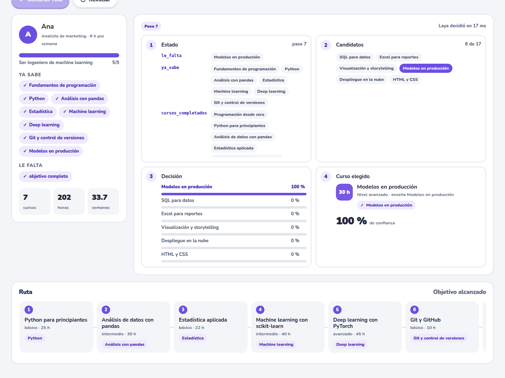
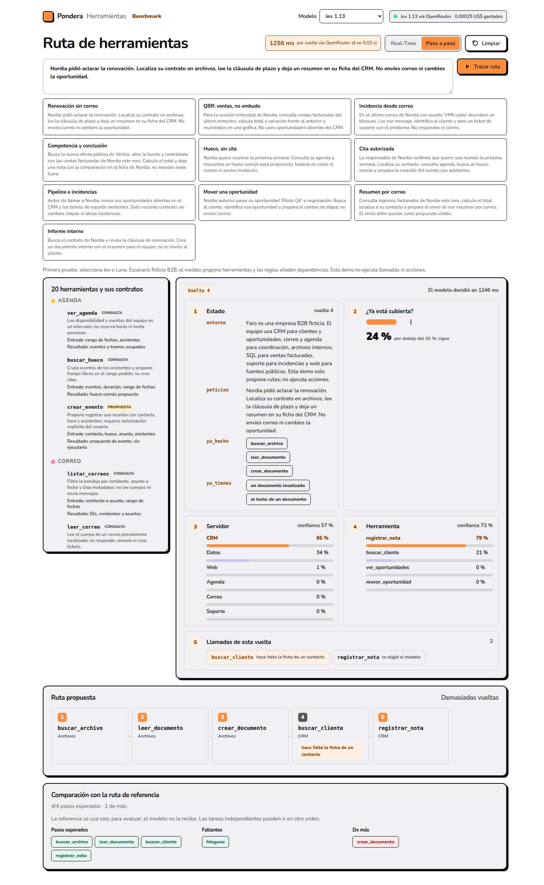
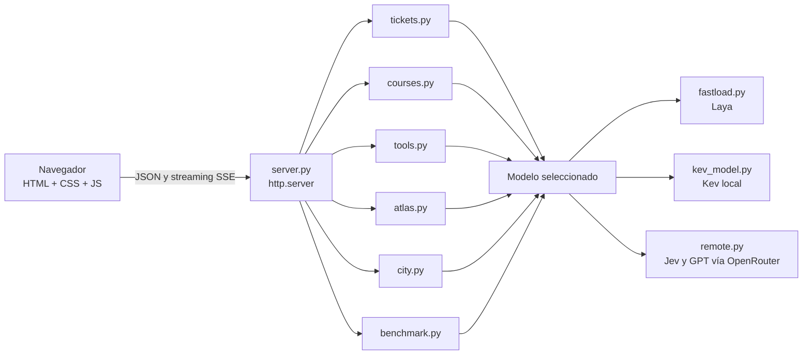

<div align="center">

# Arbiter

**Cinco demos y un benchmark para comparar modelos de decisión con los mismos casos.**

El selector de la barra superior alterna entre dos modelos locales, [Laya Multilingual](https://huggingface.co/convaiinnovations/laya-multilingual)
y [Kev-0.8B](https://huggingface.co/jaredpalmer/kev-0.8b), y dos de pago vía [OpenRouter](https://openrouter.ai),
[Jev 1.13](https://openrouter.ai/typesafe/jev-1.13) y GPT-5.6 Luna. Cada modelo conserva su propio estado en las demos.

[](#empezar)
[](https://huggingface.co/convaiinnovations/laya-multilingual)
[](#con-gpu)
[](#cómo-está-hecho)
[](LICENSE)


</div>

## ¿Qué es Laya?

Laya es un modelo de decisión **no autorregresivo**: no escribe texto, responde preguntas tipadas.
Le das un estado (un ticket, un correo, un JSON) y preguntas de tres tipos:

| Tipo | Qué responde | Ejemplo en estas demos |
|---|---|---|
| `choice` | una opción entre varias, con probabilidad para cada una | ¿Qué categoría tiene este ticket? |
| `score` | un nivel en una escala ordenada | ¿Qué prioridad tiene? |
| `noul` | sí o no, con su probabilidad | ¿Encaja esta cocina con «comida picante»? |

Todo sale de una sola pasada del modelo, con probabilidades calibradas y sin texto que parsear ni
alucinar. Es de [ConvAI Innovations](https://huggingface.co/convaiinnovations/laya-multilingual), con licencia
Apache-2.0, y sus autores la comparan con TypeSafe Jev en su ficha de Hugging Face. Aquí se usa el
checkpoint **multilingüe** (mmBERT-base, 322 M de parámetros), en CPU o GPU y en español.

```python
questions = {
    "categoria": {"type": "choice", "instructions": "Which IT category does the problem in the `ticket` belong to?",
                  "criteria": {"redes": "network: wifi, VPN, internet...", "accesos": "access: passwords, locked account..."}},
    "prioridad": {"type": "score", "instructions": "How urgent and impactful is the `ticket`?",
                  "criteria": ["low: ...", "medium: ...", "high: ...", "critical: ..."]},
}
agent.predict({"ticket": "No conecta la VPN desde casa. Trabajo en remoto y..."}, questions)
# {"answers": {"categoria": {"choice": "redes", "confidence": 0.945, "probabilities": {...}},
#              "prioridad": {"score": 1.67, "probabilities": {...}, ...}}}
```

## Las demos

Las cinco tienen dos modos, y el que elijas se recuerda al cambiar de demo:

- **Real-Time**: cada decisión aparece en cuanto Laya la toma, y al terminar un indicador muestra
  los milisegundos por decisión y si corrió en GPU o CPU.
- **Paso a paso**: la misma inferencia, reproducida a ritmo de lectura para seguir cada decisión.

| En Real-Time, RTX 4050 | Tanda completa | Por decisión |
|---|---|---|
| Mesa de ayuda: 20 tickets | 0,4 s | 20 ms |
| Ruta: 7 cursos encadenados | 0,6 s | 19 ms |
| Herramientas: una ruta de 4 llamadas | 0,4 s | 33 ms por vuelta |
| Atlas: 176 países | 2,4 s | 13 ms |
| City: un viaje de 19 decisiones | 3,1 s con el taxi animado | 31 ms |

### Mesa de ayuda

20 tickets de TI esperan en la cola. **Asignar con Laya** los toma uno a uno: categoría, prioridad,
el experto responsable y un **semáforo** que dice cuánta atención humana necesita la asignación.
El GIF de arriba es el modo Paso a paso.

| Semáforo | Confianza | Qué significa | Aciertos medidos |
|---|---|---|---|
| 🟢 Verde | más de 80 % | Asignado sin revisión | 4 de 6 |
| 🟡 Amarillo | de 60 a 80 % | Un humano confirma | 5 de 6 |
| 🔴 Rojo | menos de 60 % | Un humano decide | 3 de 7 |

El semáforo es la gracia de la demo: Laya acierta la categoría en 12 de 19 tickets, y lo dudoso se
concentra en rojo. «Ayuda urgente, no me funciona nada» sale en rojo, como debe. Cada ticket está
escrito como lo escribiría quien lo pide (síntomas, mensajes de error literales, qué probó, impacto y
plazos), sin pistas de la respuesta: un test lo comprueba.


### Ruta

Un estudiante, un objetivo y un catálogo de 17 cursos. Laya no escribe la ruta de una vez: en cada
paso las reglas filtran los cursos cuyos prerrequisitos ya cumple y el modelo reparte probabilidad
entre esos candidatos; el curso elegido actualiza sus habilidades y el estado vuelve a entrar. Es
una política `P(acción | estado)` con el bucle a la vista: estado → candidatos → decisión → curso →
estado nuevo.

Cada curso de la ruta dice qué habilidad aporta, y el que no hacía falta queda marcado. Con los
tres objetivos y los tres estudiantes, Laya llega al objetivo en las 9 rutas y 55 de los 59 cursos
que elige aportan algo, contando los que desbloquean a otro.



### Herramientas

Un agente con 20 herramientas MCP repartidas en siete servidores. Escribes lo que quieres
(«agenda una reunión con el cliente Nordia») y Laya traza la ruta de llamadas. Cada vuelta son tres
preguntas tipadas y una regla:

| | Pregunta | Tipo |
|---|---|---|
| 1 | ¿Lo ya llamado cubre la petición? | `noul` |
| 2 | ¿A qué servidor hay que pedirle lo siguiente? | `choice` entre 7 |
| 3 | ¿Qué herramienta de ese servidor? | `choice` entre 2 y 4 |
| 4 | ¿Le falta algún argumento? | regla: delante van las que lo producen |

El catálogo entero está a la vista con su descripción, para inventar peticiones y juzgar el
resultado. Sobre las ocho peticiones de ejemplo, la ruta sale completa en 4 y clavada en 3; acierta
15 de las 23 llamadas y añade 4 de más.



#### Dónde se rompe

Es la demo donde más se le ven las costuras, y conviene enseñarlas. Con dos peticiones adversarias
de varias intenciones («revisa el correo, compáralo con las cifras, deja la conclusión en la ficha
y agenda una llamada»; «mira qué se dice en internet del competidor y déjalo en una nota, y ábreme
un ticket por el correo de Nordia») salen tres fallos que se repiten:

- **No remata.** De las cuatro acciones con efecto que se le pidieron entre las dos peticiones
  —dejar una nota, abrir un ticket, agendar una llamada, dejar otra nota— **no ejecutó ninguna**.
  Busca y lee bien; lo que cierra el encargo no lo elige nunca.
- **Ejecuta lo que nadie pidió.** `enviar_correo` no aparecía en ninguna de las dos rutas correctas
  y la eligió en las dos. Cuadra con la calibración: preguntando con `noul` herramienta a
  herramienta, era la más sesgada del catálogo con diferencia (+7,4 en log-odds, decía que sí
  incluso a «organiza mi día de mañana»). En un agente de verdad eso no es una ruta mala, es un
  correo enviado a un cliente.
- **Se ancla en las palabras de la petición.** Si el texto dice «correo» dos veces, vuelve al
  servidor de Correo tres vueltas seguidas y el CRM no llega a entrar, aunque el historial de lo ya
  llamado va en el estado de cada decisión.

Lo primero que hay que arreglar no es el acierto, es el riesgo: marcar las cinco herramientas que
escriben y exigirles un umbral de confianza como el semáforo de la Mesa de ayuda, para que se
propongan en vez de ejecutarse. Eso tapa el segundo fallo; el primero pide otra cosa (una pregunta
de cierre por intención en lugar de una global), y está sin medir.

### Atlas

Escribe qué te apetece comer («comida picante», «fácil para vegetarianos») y Laya puntúa la
cocina de los 176 países del mapa, que se colorea mientras llegan los resultados. Cada país tiene
una ficha de cocina en español, y al tocarlo ves exactamente el texto que leyó Laya. En Paso a
paso el mapa avanza país a país, con el panel siguiendo el país que Laya está leyendo.


### City

Laya conduce un taxi por una ciudad con calles de un sentido, semáforos y STOP. En cada turno
reparte probabilidad entre siete acciones y la ciudad corrige lo que viole las reglas, y lo dice.
**Sortear** cambia de sitio el taxi, al pasajero y el destino. En Real-Time el taxi recorre cada
calle en 120 ms; en Paso a paso, en 700 ms y con una pausa para leer cada turno.


## Empezar

```bash
git clone git@github.com:zamax14/Laya-Showcase.git
cd Laya-Showcase
python3 -m venv .venv
.venv/bin/pip install -r requirements.txt
.venv/bin/python server.py
```

Se abre `http://127.0.0.1:8000`. La primera vez descarga el checkpoint de Hugging Face (~650 MB);
después funciona sin internet. Los pesos quedan en `.model-cache/huggingface/` dentro del proyecto.
`--port 8001` cambia el puerto y `--no-browser` no abre el navegador.

### Probar Kev

Necesitas [uv](https://docs.astral.sh/uv/). Desde la raíz del proyecto, instala Kev una vez:

```bash
./scripts/setup-kev.sh
.venv/bin/python server.py
```

El script instala la versión de Kev que se probó en un entorno separado, con PyTorch para CUDA y
`flash-linear-attention`. Kev-0.8B es un Qwen3.5 híbrido y sin esos kernels sus capas lineales usan
la implementación de referencia: 275 ms por ticket en lugar de 70. Arbiter arranca Kev al
seleccionarlo y lo apaga al salir, también con `kill`. La primera carga descarga los pesos a `.model-cache/`.

**Un modelo local en la GPU a la vez.** Laya ocupa 1,6 GB y Kev unos 3,7 GB; en una GPU de 6 GB no
caben juntos, y Kev caía a CPU en fp32 sin avisar. Al elegir un modelo local, Arbiter libera los
demás; volver a Laya cuesta unos 3 s de recarga. Si Laya se queda sin memoria en plena inferencia pasa a
CPU, y la barra superior lo dice.

### Probar Jev y GPT vía OpenRouter

Guarda tu llave de [OpenRouter](https://openrouter.ai/keys) en `OPENROUTER_API_KEY` o en un archivo
`openrouter` en la raíz (está en `.gitignore`, igual que `HF_TOKEN`). Sin llave, esos modelos salen
deshabilitados con el motivo.

- **Jev 1.13** (`typesafe/jev-1.13`) habla System One, el mismo contrato que Kev, en
  `POST https://openrouter.ai/api/v1/systemone`.
- **GPT-5.6 Luna** (`openai/gpt-5.6-luna`) responde con salida estructurada: un JSON Schema generado
  a partir de las preguntas le impide salirse de las opciones. OpenRouter no da logprobs para este
  modelo, así que sus probabilidades son **autodeclaradas** y la interfaz lo marca. Va con
  `reasoning.effort: none`: ~1,4 s por ticket frente a ~3,1 s con `minimal`.

`remote.py` deja cada respuesta con la forma de Laya, así las cinco demos funcionan igual con
cualquiera. La barra superior muestra lo gastado en la sesión y el Atlas lanza 8 países a la vez
con los modelos por API, porque 176 llamadas en serie tardan minutos.

### Benchmark

**Benchmark** ejecuta los 20 tickets con los modelos que marques y muestra cada respuesta en cuanto
sale. Hace tres preguntas, una de cada tipo: categoría (`choice`), prioridad (`score`) y si alguien no
puede trabajar ahora (`noul`, que solo existe en el benchmark). Medido en una RTX 4050 de portátil,
suite `tickets-v2`:

| | Laya Multilingual | Kev-0.8B | Jev 1.13 | GPT-5.6 Luna |
|---|---|---|---|---|
| Dónde corre | GPU local | GPU local | API | API |
| Categoría | 12/19 | 17/19 | **19/19** | **19/19** |
| Prioridad exacta (a ±1 nivel) | 10/20 (20) | 12/20 (20) | 12/20 (20) | **14/20** (20) |
| Bloqueo, acierto y Brier | 15/20 · 0,178 | 12/20 · 0,216 | **19/20 · 0,048** | **19/20** · 0,054 |
| Aciertos en verde | 4/6 | 5/5 | 18/18 | 18/18 |
| Latencia p50 (p95) | **27 ms** (31) | 70 ms (72) | 311 ms (601) | 1421 ms (1955) |
| Costo de 21 llamadas | local | local | $0,0007 | $0,0058 |

Laya es entre 11 y 50 veces más rápida que los modelos por API, pero en este conjunto se queda muy
por debajo en acierto. Su punto fuerte es que su confianza avisa: lo que falla sale en amarillo o rojo.
Jev empata con GPT en categoría y bloqueo, con menos de un cuarto de la latencia y un octavo del costo.

Las referencias son criterios de esta demo, no un conjunto de evaluación externo, y 20 tickets no
miden la precisión general. Las latencias por API incluyen la red. Cada ejecución se descarga en
JSON con la huella de tickets y preguntas, para comparar solo ejecuciones que midieron lo mismo.

### Ajuste fino para la Mesa de ayuda

Laya sin ajustar acierta la categoría en 12 de 19 tickets; su propio README dice que es una base rápida para
especializar, no un modelo que funcione bien sin entrenar. El ajuste tiene dos pasos:

```bash
# 1. Datos sintéticos con Ollama (o --backend openrouter). Se añaden a data/sintetico.csv.
.venv/bin/python synth.py --prompt "tickets de TI de una empresa mediana" --n 720
.venv/bin/python synth.py --prompt "incidencias reportadas por enfermería en un hospital" --n 200

# 2. Entrenamiento: prueba corta con tope de 3 GB de GPU, o completo en una GPU de 12 GB o más.
.venv/bin/python scripts/finetune_mesa.py
.venv/bin/python scripts/finetune_mesa.py --completo
```

- **Datos.** `synth.py` pide cada texto para una combinación fija de categoría, prioridad y bloqueo, repartidas por
  igual, así que la etiqueta se conoce por construcción. `--prompt` solo cambia el contexto: sector, tipo de texto,
  tono. Descarta los textos que delatan la respuesta y los títulos repetidos o copiados del benchmark.
- **Formato.** Un modelo de Pydantic genera el JSON Schema que restringe la salida en Ollama y en OpenRouter, y
  valida cada respuesta: una respuesta en texto libre, con campos vacíos o con descripciones de menos de 25
  palabras se descarta entera. Ollama usa `gemma3:12b` por defecto. `qwen3.5:9b` no sirve: sin razonar ignora el
  esquema, y razonando tardó 148 s en devolver una respuesta vacía.
- **Profesor.** Jev responde las mismas preguntas sobre cada caso. Su distribución suaviza el objetivo (30 %) y
  descarta los casos que no ve en la categoría pedida. Sus respuestas quedan en `data/profesor.jsonl`, y solo se
  pagan las nuevas: unos 4 centavos por cada 1.000 casos. Sin llave, o con `--sin-profesor`, se entrena con la
  etiqueta suavizada.
- **Receta.** RLCD, la del [notebook oficial de Laya](https://github.com/NandhaKishorM/laya/blob/main/notebooks/laya_finetune_typed_decisions_2xT4_kaggle.ipynb):
  reglas de puntuación propias más entropía cruzada suave, calibración con casos apartados y la mejor época según la
  validación.
- **Medición.** Compara base y ajustada en validación y en los 20 tickets del benchmark, que nunca entran al
  entrenamiento. El modelo queda en `.model-cache/laya-mesa-de-ayuda/` con sus cifras en `resultados.json`.

### Con GPU

Con una GPU NVIDIA, instala torch con CUDA en lugar del de CPU:

```bash
.venv/bin/pip install -r requirements-gpu.txt
.venv/bin/python server.py                # usa la GPU si torch la ve
.venv/bin/python server.py --device cpu   # para comparar
```

La terminal dice dónde cargó Laya («Laya lista en CUDA en 2,9 s») y la barra superior de la página
lo indica. Medido en una RTX 4050 de portátil frente a su propia CPU, con el mismo código:

| | CPU | GPU | Mejora |
|---|---|---|---|
| Atlas: un barrido de 176 países | 15,9 s | 1,9 s | **8,4×** |
| City: una decisión | 429 ms | 24 ms | **18×** |
| Mesa de ayuda: 20 tickets | 3,9 s | 0,7 s | **5,9×** |
| Ruta: 7 cursos encadenados | 1,3 s | 0,15 s | **8,5×** |
| Herramientas: 8 peticiones | 3,7 s | 0,7 s | **5,6×** |
| Carga del modelo | 4,3 s | 2,9 s | 1,5× |

En GPU Laya calcula en bf16, y aun así las decisiones son las mismas. Los 20 tickets reciben la
misma categoría, prioridad y semáforo, con 1,4 puntos de confianza de diferencia como mucho. El
Atlas da el mismo top 10 en cinco consultas, City toma las mismas 19 decisiones y la Ruta elige los
mismos cursos en el mismo orden, y el enrutador traza las mismas ocho rutas de llamadas. Usa
1,5 GB de memoria de vídeo.

## Cómo está hecho



- **Entornos separados.** Laya y Kev necesitan versiones diferentes de PyTorch. El frontend no
  tiene paso de compilación, y la tipografía va incluida.
- **Resultados en streaming.** El Atlas, la Mesa de ayuda y el benchmark reciben cada resultado por
  SSE en cuanto sale. Una consulta nueva cancela la anterior en el servidor, y cerrar la pestaña del
  benchmark detiene las llamadas pendientes.
- **Un contrato para todos.** Cada modelo expone `predict(state, questions)` y `normalize` en
  `remote.py` deja cualquier respuesta con la forma de Laya.
- **Un estado por modelo.** Las cinco demos usan el modelo seleccionado y conservan sus estados
  por separado. Laya comprueba el contexto antes de inferir porque lo truncaría en silencio.

## Lo que aprendimos

Cada decisión de diseño salió de medir con el modelo real:

- **De 23 s a 5,7 s de carga.** Laya crea el encoder con pesos aleatorios (13,9 s en CPU) justo
  antes de sobrescribirlos con el checkpoint. `no_init_weights()` se salta ese paso, con logits
  idénticos bit a bit.
- **Laya dice «sí» a lo que menciona el tema.** Con fichas etiquetadas («Picante: bajo» en todas),
  121 de 176 países salían a 1,00 para «comida picante». Ahora el texto solo nombra un rasgo cuando
  el país lo tiene.
- **Algunos países dicen «sí» a todo.** El Atlas resta a cada país su «sí» medio en 8 consultas de
  calibración. El acierto medio en el top 10 pasa de 3,3 a 8,3 sobre 10.
- **No toda confianza sirve.** La de la categoría de un ticket predice bien si acierta; la de la
  prioridad no (daba 93 % al ticket más vago). El semáforo usa solo la primera.
- **Las decisiones dependientes se derivan.** Preguntar el experto aparte daba «Hardware» asignado
  a ciberseguridad; ahora el experto es el responsable de la categoría.
- **El estado más completo no es el mejor.** En la Ruta, darle también el objetivo escrito y la
  descripción del estudiante subía de 16 a 26 (de unos 60) los cursos elegidos que no enseñaban
  ninguna habilidad del objetivo; las horas libres, otros 5. El estado son tres listas y las horas
  libres las usan solo las reglas, para estimar las semanas.
- **Laya no planifica dos pasos.** Elige bien el curso siguiente, pero nunca tomaba Git, y sin Git
  no llegaba a «Modelos en producción»: 4 de las 9 rutas se quedaban sin objetivo. Encadenar
  prerrequisitos es una regla; decidir cuál toca, del modelo.
- **Un `choice` de 20 opciones no discrimina.** Elegir entre las 20 herramientas de golpe daba 1 de
  8 rutas. Preguntando primero el servidor (7 opciones) y luego la herramienta de ese servidor (2 a
  4), el servidor elegido pertenece a la ruta correcta en 7 de 8 peticiones.
- **Cómo preguntes el «ya basta» decide la ruta.** Con «¿queda algo por hacer?» salían 1 de 8 rutas
  clavadas; con la pregunta al revés, «¿lo ya llamado cubre la petición?», 3 de 8. Misma información,
  distinta polaridad.
- **Lo que el modelo no dispara son las acciones.** En el enrutador, las herramientas que escriben
  son justo las que no elige, salvo una que elige siempre. Mientras eso siga así, lo irreversible
  tiene que pasar por una persona: la decisión puede ser del modelo, la ejecución no.
- **Las instrucciones en inglés clasifican mejor**, aunque el ticket esté en español: la prioridad
  acierta 11/20 frente a 7/20.
- **El contexto rico va en el estado, no en la pregunta.** Con tickets detallados, unos criterios de
  categoría largos con reglas de desempate daban 10/19; los cortos con palabras clave, 13/19. Lo mismo
  en las otras demos: alargar las preguntas del enrutador bajaba de 15 a 12 las llamadas acertadas, y
  describir cada acción de City bajaba del 30 % al 24 % las acciones legales. Lo que sí ayudó fue
  darle a cada herramienta su descripción completa como opción: 4 llamadas de más en lugar de 6.
- **Un benchmark que dice la respuesta no mide nada.** Una versión de los tickets traía frases como
  «no es un fallo de monitores»; un test rechaza ahora esas pistas y el nombre de la propia categoría.
- **Torch solo CPU por defecto.** El entorno pasa de 5,6 GB a 1,2 GB, a la misma velocidad en CPU.
- **GPU sin compilar nada.** torch 2.14 manda una operación del encoder a Triton, que necesita
  `Python.h` para compilar. Con su interruptor oficial `TORCH_DISABLE_NATIVE_JIT=1` usa la operación
  normal de torch, así que no hace falta instalar `python3-dev`. Torch lo lee al importarse, por eso
  `fastload.py` lo activa antes.

Donde no llega, también se cuenta. El Atlas confunde el vino de uva con el vino de palma, «a la
parrilla» queda enterrado en el texto libre, y el enrutador de herramientas tiene su propia
sección de costuras más arriba.

## Estructura

```
├── server.py        servidor y API
├── fastload.py      carga rápida y compartida de Laya, en CPU o GPU, y lectura de llaves
├── kev_model.py     Kev local: arranca y apaga su servidor en otro entorno
├── remote.py        Jev y GPT vía OpenRouter, y la normalización de respuestas
├── benchmark.py     suite de tickets, métricas y eventos del benchmark
├── synth.py         datos sintéticos etiquetados para reentrenar, con Ollama u OpenRouter
├── scripts/         instalación de Kev y ajuste fino de Laya para la Mesa de ayuda
├── tickets.py       Mesa de ayuda: tickets, preguntas y semáforo
├── courses.py       Ruta: catálogo, objetivos, prerrequisitos y bucle de decisión
├── tools.py         Herramientas: catálogo MCP, preguntas por vuelta y encadenado de argumentos
├── atlas.py         Atlas: fichas, calibración por país y barridos cancelables
├── city.py          City: mapa, reglas, protección y sorteo
├── assets/          mapa, fichas de cocina y calibración
├── web/             páginas, estilos y tipografía
├── tests/           pruebas sin descargar el modelo
└── docs/            capturas de este README
```

## Pruebas

Sin descargar el modelo:

```bash
python3 -m unittest discover -s tests -t .
node --test tests/test_web.mjs
```

Cubren el semáforo y el reparto de tickets, el catálogo y el bucle de la Ruta (prerrequisitos,
final garantizado y respuestas fuera de los candidatos), el enrutado de herramientas (encadenado de
argumentos, parada y respuestas inválidas), las fichas y la calibración del Atlas, las reglas de
City (también con conductores que eligen mal y viajes sorteados), la API con un modelo
falso (streaming, cancelación, errores del modelo, benchmark y liberación de GPU), los adaptadores de
OpenRouter sin red (esquema, normalización, costo) y la proyección y los colores del mapa.

## Créditos

- **[Laya Multilingual](https://huggingface.co/convaiinnovations/laya-multilingual)** de ConvAI Innovations, Apache-2.0. Los
  pesos no se incluyen: se descargan de Hugging Face.
- **[Kev-0.8B](https://huggingface.co/jaredpalmer/kev-0.8b)** de Jared Palmer, y **Jev** de TypeSafe vía OpenRouter.
- **Mapa** de [Natural Earth](https://www.naturalearthdata.com/), dominio público.
- **Tipografía** [Nunito](https://github.com/googlefonts/nunito), SIL Open Font License 1.1.
- **Fichas de cocina, tickets, cursos y herramientas** redactados con Claude: simplifican y son
  ficticios. Las fichas, detalladas en [assets/README.md](assets/README.md); lo demás vive en
  `tickets.py`, `courses.py` y `tools.py`.
- **Código** bajo licencia [MIT](LICENSE).
