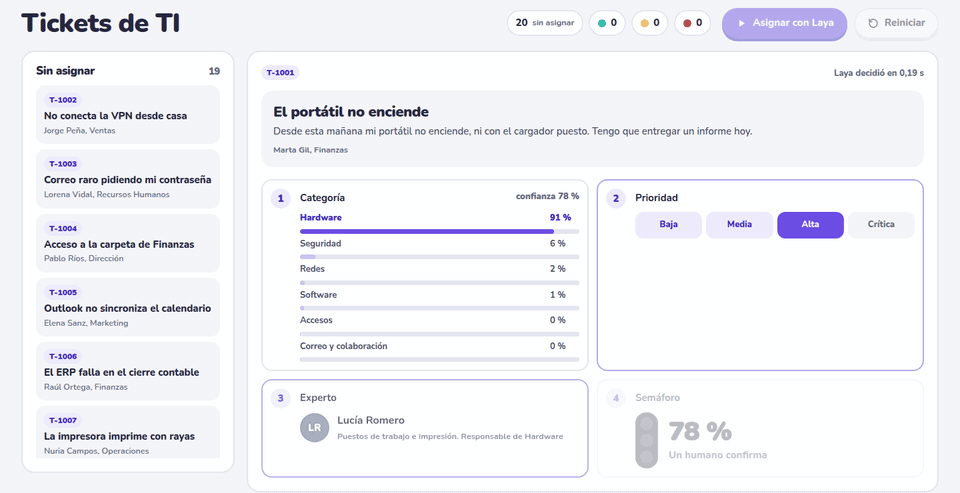
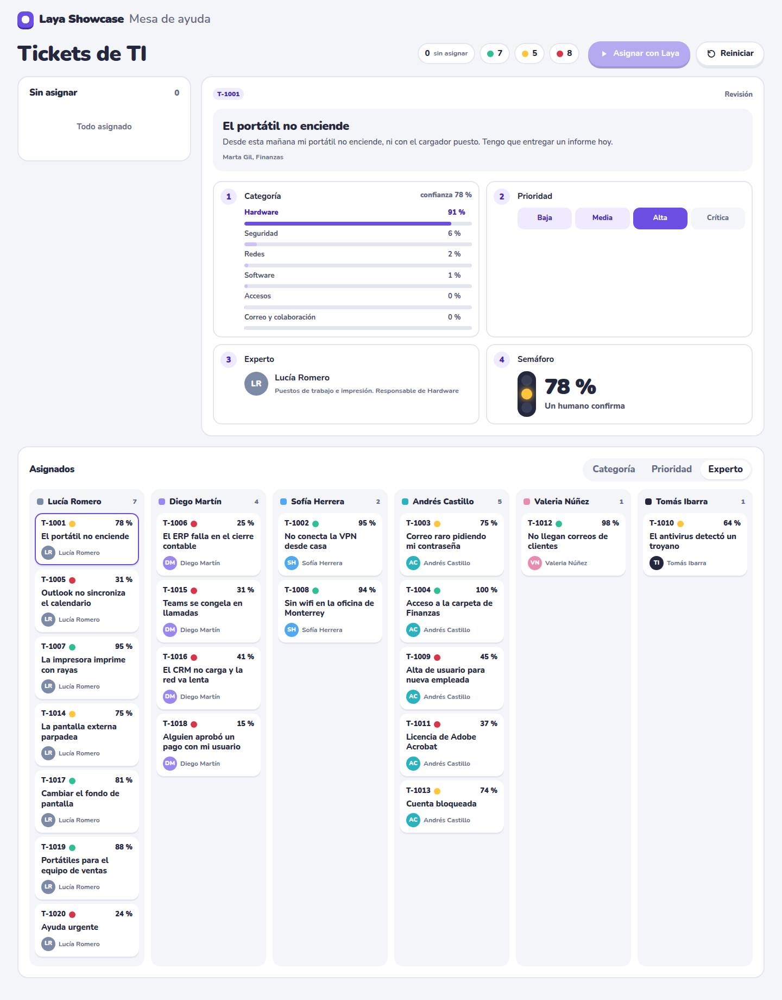
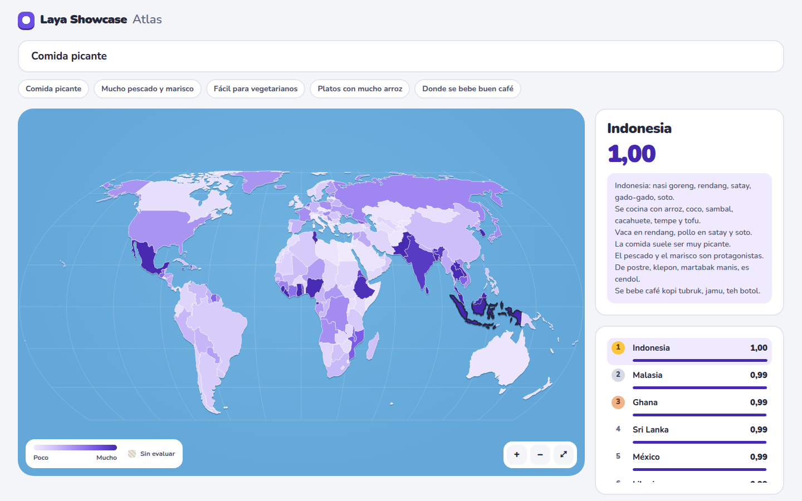
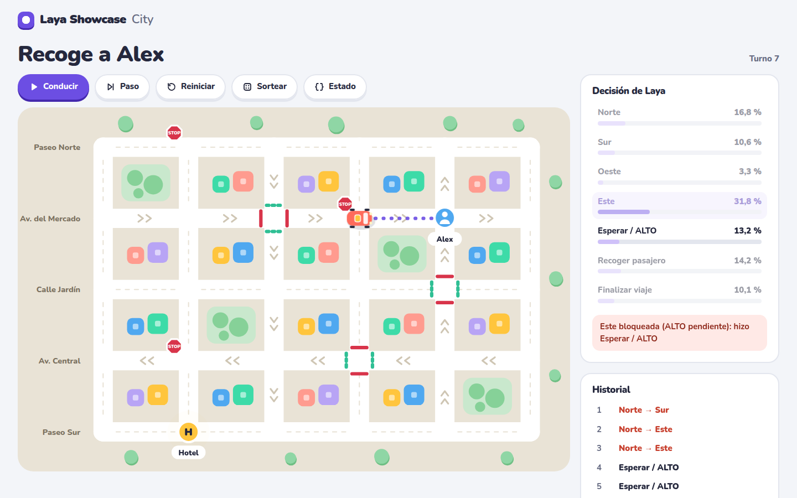
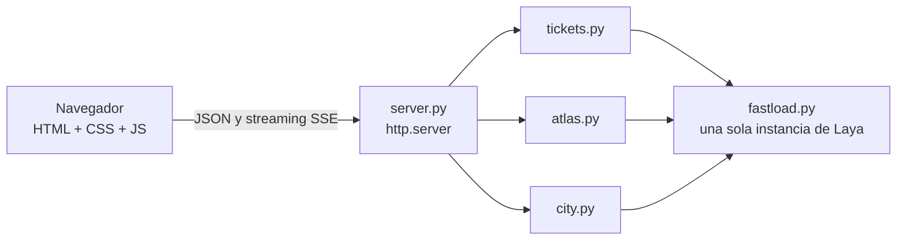

<div align="center">

# Laya Showcase

**Tres demos en el navegador para ver decidir a [Laya](https://huggingface.co/convaiinnovations/laya),
un modelo de decisión open source que corre en tu CPU.**

[](#empezar)
[](https://huggingface.co/convaiinnovations/laya)
[](#cómo-está-hecho)
[](LICENSE)



</div>

## ¿Qué es Laya?

Laya es un modelo de decisión **no autorregresivo**: no escribe texto, responde preguntas tipadas.
Le das un estado (un ticket, un correo, un JSON) y preguntas de tres tipos:

| Tipo | Qué responde | Ejemplo en estas demos |
|---|---|---|
| `choice` | una opción entre varias, con probabilidad para cada una | ¿Qué categoría tiene este ticket? |
| `score` | un nivel en una escala ordenada | ¿Qué prioridad tiene? |
| `noul` | sí o no, con su probabilidad | ¿Encaja esta cocina con «comida picante»? |

Todo sale de una sola pasada del modelo, con probabilidades calibradas y sin texto que parsear ni
alucinar. Es de [ConvAI Innovations](https://huggingface.co/convaiinnovations/laya), con licencia
Apache-2.0, y sus autores la comparan con TypeSafe Jev en su ficha de Hugging Face. Aquí se usa el
checkpoint **multilingüe** (mmBERT-base, 322 M de parámetros), en CPU y en español.

```python
questions = {
    "categoria": {"type": "choice", "instructions": "Which IT category does the problem in the `ticket` belong to?",
                  "criteria": {"redes": "network: wifi, VPN, internet...", "accesos": "access: passwords, locked account..."}},
    "prioridad": {"type": "score", "instructions": "How urgent and impactful is the `ticket`?",
                  "criteria": ["low: ...", "medium: ...", "high: ...", "critical: ..."]},
}
agent.predict({"ticket": "No conecta la VPN desde casa. Trabajo en remoto y..."}, questions)
# {"answers": {"categoria": {"choice": "redes", "confidence": 0.945, "probabilities": {...}},
#              "prioridad": {"score": 1.67, "probabilities": {...}, ...}}}
```

## Las demos

### Mesa de ayuda

20 tickets de TI esperan en la cola. **Asignar con Laya** los toma uno a uno y enseña cada paso:
categoría, prioridad, el experto responsable y un **semáforo** que dice cuánta atención humana
necesita la asignación.

| Semáforo | Confianza | Qué significa | Aciertos medidos |
|---|---|---|---|
| 🟢 Verde | más de 80 % | Asignado sin revisión | 6 de 7 |
| 🟡 Amarillo | de 60 a 80 % | Un humano confirma | 4 de 5 |
| 🔴 Rojo | menos de 60 % | Un humano decide | 2 de 8 |

El semáforo es la gracia de la demo: Laya acierta la categoría en 12 de 19 tickets, pero su
confianza separa bien lo fiable de lo dudoso. «Ayuda urgente, no me funciona nada» sale en rojo,
como debe.



### Atlas

Escribe qué te apetece comer («comida picante», «fácil para vegetarianos») y Laya puntúa la
cocina de los 176 países del mapa, que se colorea mientras llegan los resultados. Cada país tiene
una ficha de cocina en español, y al tocarlo ves exactamente el texto que leyó Laya.



### City

Laya conduce un taxi por una ciudad con calles de un sentido, semáforos y STOP. En cada turno
reparte probabilidad entre siete acciones y la ciudad corrige lo que viole las reglas, y lo dice.
**Sortear** cambia de sitio el taxi, al pasajero y el destino.



## Empezar

```bash
git clone git@github.com:zamax14/Laya-Showcase.git
cd Laya-Showcase
python3 -m venv .venv
.venv/bin/pip install -r requirements.txt
.venv/bin/python server.py
```

Se abre `http://127.0.0.1:8000`. La primera vez descarga el checkpoint de Hugging Face (~650 MB);
después funciona sin internet. `--port 8001` cambia el puerto y `--no-browser` no abre el navegador.

## Cómo está hecho



- **Sin dependencias extra.** Aparte de `laya`, solo la biblioteca estándar de Python. El frontend
  no tiene paso de compilación, y la tipografía va incluida.
- **Resultados en streaming.** El Atlas y la Mesa de ayuda reciben cada resultado por SSE en cuanto
  sale. Una consulta nueva cancela la anterior en el servidor.
- **Un modelo para todo.** Las tres demos comparten una instancia de Laya con las inferencias en
  serie. Antes de cada inferencia se comprueba que el estado cabe en el contexto, porque Laya lo
  truncaría en silencio.

## Lo que aprendimos

Cada decisión de diseño salió de medir con el modelo real:

- **De 23 s a 5,7 s de carga.** Laya crea el encoder con pesos aleatorios (13,9 s en CPU) justo
  antes de sobrescribirlos con el checkpoint. `no_init_weights()` se salta ese paso, con logits
  idénticos bit a bit.
- **Laya dice «sí» a lo que menciona el tema.** Con fichas etiquetadas («Picante: bajo» en todas),
  121 de 176 países salían a 1,00 para «comida picante». Ahora el texto solo nombra un rasgo cuando
  el país lo tiene.
- **Algunos países dicen «sí» a todo.** El Atlas resta a cada país su «sí» medio en 8 consultas de
  calibración. El acierto medio en el top 10 pasa de 3,3 a 8,3 sobre 10.
- **No toda confianza sirve.** La de la categoría de un ticket predice bien si acierta; la de la
  prioridad no (daba 93 % al ticket más vago). El semáforo usa solo la primera.
- **Las decisiones dependientes se derivan.** Preguntar el experto aparte daba «Hardware» asignado
  a ciberseguridad; ahora el experto es el responsable de la categoría.
- **Las instrucciones en inglés clasifican mejor**, aunque el ticket esté en español: la prioridad
  acierta 11/20 frente a 7/20.
- **Torch solo CPU.** El entorno pasa de 5,6 GB a 1,2 GB, a la misma velocidad.

Donde no llega, también se cuenta. El Atlas confunde el vino de uva con el vino de palma, y
«a la parrilla» queda enterrado en el texto libre.

## Estructura

```
├── server.py        servidor y API
├── fastload.py      carga rápida y compartida de Laya
├── tickets.py       Mesa de ayuda: tickets, preguntas y semáforo
├── atlas.py         Atlas: fichas, calibración por país y barridos cancelables
├── city.py          City: mapa, reglas, protección y sorteo
├── assets/          mapa, fichas de cocina y calibración
├── web/             páginas, estilos y tipografía
├── tests/           pruebas sin descargar el modelo
└── docs/            capturas de este README
```

## Pruebas

Sin descargar el modelo:

```bash
python3 -m unittest discover -s tests -t .
node --test tests/test_web.mjs
```

Cubren el semáforo y el reparto de tickets, las fichas y la calibración del Atlas, las reglas de
City (también con conductores que eligen mal y viajes sorteados), la API con un modelo falso
(streaming, cancelación, errores del modelo) y la proyección y los colores del mapa.

## Créditos

- **[Laya](https://huggingface.co/convaiinnovations/laya)** de ConvAI Innovations, Apache-2.0. Los
  pesos no se incluyen: se descargan de Hugging Face.
- **Mapa** de [Natural Earth](https://www.naturalearthdata.com/), dominio público.
- **Tipografía** [Nunito](https://github.com/googlefonts/nunito), SIL Open Font License 1.1.
- **Fichas de cocina y tickets** redactados con Claude: simplifican y son ficticios. Detalle en
  [assets/README.md](assets/README.md).
- **Código** bajo licencia [MIT](LICENSE).
